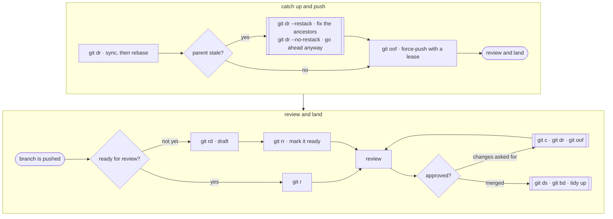

# Opening a pull request

Get the branch onto current reality, push it, open the PR, and clean up after it
lands.



## Catch up first

```sh
git dr
```

One command, several decisions:

```
master: 9f4063c -> f79b80c
branch point: recorded 9f4063c
replaying 2 commit(s) onto master
COM-12345.rebuild-window: 06758ec -> a1b2c3d
```

- Syncs the default branch (from `upstream` first when you have a fork) and says
  what moved.
- Works out where your own work begins, from the recorded branch point.
- **Skips work that has already landed.** A commit of yours that was merged, or a
  parent branch that was squash-merged, is not replayed. It says how many it
  skipped and where it resumed.
- Rebases onto your **parent branch** if you're stacked and the parent is still
  open; onto the default branch once the parent has landed.
- Requires a clean tree. Commit or stash first.

A branch with nothing of its own left gets moved up to the default branch, which
is what `git rebase master` would have done.

When the parent is itself behind, `dr` stops and makes you choose:

```sh
git dr --restack      # rebase the ancestors bottom-up first
git dr --no-restack   # rebase onto the stale parent anyway
git dr <commit-ish>   # name the branch point yourself
```

## Push

```sh
git oof
```

A rebase rewrites commits, so the plain push is refused — that's expected, not a
problem. `oof` force-pushes to origin with a lease: it refuses if the remote
branch has moved since you last fetched, so you can't flatten someone else's push.
`uff` is the same for upstream.

First push of a branch, before any rebase, `git o` is enough — and `r` pushes it
for you anyway, to your own fork, as an ordinary push. That's why a rebased
branch has to go up with `oof` before `r` will get past the push.

## Open it

```sh
git r              # a pull request
git rd             # …as a draft
```

What it builds:

- **Title** from the branch name: `COM-12345.rebuild-window` →
  `[COM-12345] Rebuild Window`. No model call.
- **Body** from git — ticket links, `issue:` trailers, a co-author trailer copied
  from your commits, a test-plan pointer — with the model writing only Why, What,
  Blast radius and the reading guide. `rules/pr.md` is that prompt.
- **Base repo**: `upstream` when your fork really is a fork of it, else `origin`.
- **Base branch**: your parent branch if you're stacked, else the default branch.

It opens the body in your editor before creating anything.

```sh
git r -y                       # skip the editor
git r --no-summary             # no model call; the prose sections are stubbed
git r --base master            # target a different branch
git r --repo owner/repo        # target a different repo
git r 'My title' 'My body'     # supply either outright
```

Then:

```sh
git rr    # draft → ready
git urr   # ready → draft
```

`rr` and `r` move the ticket if `at.status.*` is set for them.

## After it lands

```sh
git ds    # sync the default branch
git bd    # delete branches whose work has landed
```

`bd` judges by content, not ancestry, so it sees squash-merged branches — the ones
`git branch --merged` never lists. It shows the list and asks before deleting.

## What can bite

**`r` refuses when the fork relationship isn't real.** Two repos that share
history locally are unrelated on GitHub unless one was forked from the other, and
a PR between them can't be created. `r` checks before pushing and says so, rather
than opening a PR somewhere you didn't ask for. `--repo` overrides it.

**A stacked PR targets its parent.** That's what makes it reviewable — it shows
your commits, not the parent's. When the parent lands, `dr` moves you onto the
default branch and the PR follows.

**Force-push refusals are information.** `oof` refusing means the remote branch
moved. Fetch and look before you reach for `git push -f`.

**The generated body is a draft.** It sees commit subjects and a diffstat, not
your reasoning. Read it in the editor.
