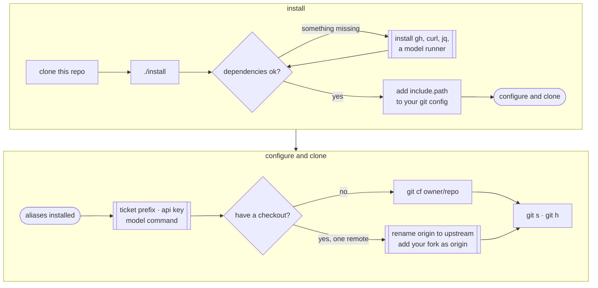

# Getting set up

Three things, in order: install the commands, tell them about your tracker and
your model, then get a checkout with the remotes they expect. Ten minutes, and
most of it is optional — every setting you skip costs you one feature, not the
tool.



## Installing the commands

```sh
git clone git@github.com:adrian-enspired/gitconfig.git
cd gitconfig
./install
```

That copies `git-at`, the `rules/` prompt files and `at-aliases.gitconfig` into
`~/.config/git/`. It never writes your git config — it prints the line to add:

```sh
git config --global --add include.path ~/.config/git/at-aliases.gitconfig
```

Run that and `git h` lists the commands.

Re-run `./install` whenever you pull changes; it overwrites the installed copies
and leaves your config alone. `./install -n` shows what it would copy without
copying.

### What needs to be on your PATH

`install` checks and tells you what's missing:

```
Dependencies:

  git    ok
  gh     ok
  curl   ok
  jq     ok
  model  ok (claude)
```

| | Without it |
| --- | --- |
| `git` | nothing works |
| `gh` | no `cf`, no pull requests (`r`, `rd`, `rr`, `urr`), no base lookup in `bk -r` |
| `curl` | no ticket titles, links or status changes |
| `jq` | the tracker's replies can't be read |
| a model runner | no generated commit messages, PR bodies or branch slugs |

Nothing is fatal. A missing `gh` means the PR commands stop and say so; the
branching, committing and rebasing commands don't care.

## Telling it about your setup

```sh
./install --help
```

Prints every setting, its current value and where that value came from. A dash
means unset, followed by what it's for. Secrets show as `<set, 48 characters>`,
never their value, so the output is safe to paste into a bug report.

| Setting | Without it |
| --- | --- |
| `at.ticket.prefix` | `git dk 12345` can't build a key; pass `COM-12345` |
| `at.linear.apikey` | no ticket titles, no status transitions |
| `at.linear.workspace` | ticket links in PR bodies are bare keys |
| `at.llm.command` | `git c` needs `-m`; slugs come from the first four words of the title |

### The model runner

Anything that takes a prompt on stdin and prints the answer to stdout. Claude is
the expected one:

```sh
git config --global at.llm.command 'claude -p --model haiku --allowed-tools= --setting-sources='
```

Those two empty flags matter: `claude -p` is an agent, and with its tools and
settings loaded it will go and read your repo instead of answering the prompt —
slower, sometimes wrong, and it drags in the project's `.claude/` settings, which is
where warnings about permission rules come from.

Write them with `=` and nothing after, as above. The `--flag ""` spelling means the
same thing but only survives if the whole value was single-quoted when you set it;
double-quote it and the empty strings vanish, leaving `--allowed-tools
--setting-sources` — which loads everything the flags were there to switch off.

Ollama works the same way, as does anything else meeting that contract:

```sh
git config --global at.llm.command 'ollama run qwen3:4b'
```

Set `at.llm.slugcommand`, `at.llm.commitcommand` or `at.llm.prcommand` to use a
different model per feature — a small one for slugs, something larger for PR
bodies.

### Tickets from a tracker this doesn't talk to

Keys from a retired Jira, say, get recognised and linked but never looked up:

```sh
git config --global at.ticket.ignored-prefixes 'MAD- MADRR- NXERR-'
git config --global at.ticket.ignored-url 'https://example.atlassian.net/browse/%s'
```

### The git settings it assumes

The `gitconfig` file in this repo is a reference, not something `install` copies.
Some of it is taste; but other settings earn their place:

| Setting | Why |
| --- | --- |
| `push.autoSetupRemote = true` | `git o` on a new branch pushes and sets tracking, instead of telling you to name the upstream |
| `push.followTags = true` | `git t` doesn't push; the next push carries the tag |
| `rebase.updateRefs = true` | rebasing a stack moves the branch refs inside it, instead of stranding them |
| `rerere.enabled = true` | restacking the same branch twice doesn't mean resolving the same conflict twice |
| `rebase.autoStash = true` | a rebase over a dirty tree stashes and restores instead of refusing |
| `pull.rebase = true` | pulls don't scatter merge commits through a branch you're about to rebase |
| `tag.sort = version:refname` | `git tag` sorts v10 after v9, not alphabetically between v1 and v2 |

The rest — diff algorithm, colour, `help.autocorrect` — is preference. Copy what
you like.

## Getting a checkout

```sh
git cf adrian-enspired/gitconfig
```

Forks the repo, clones your fork, and prints what you got:

```
cloned into ./gitconfig
  upstream  git@github.com:adrian-enspired/gitconfig.git
  origin    git@github.com:you/gitconfig.git
```

**`upstream` is theirs, `origin` is yours.** That split is what `ds`, `dr` and `r`
are built around: one place to take work from, another to push it to.

### If you already have a clone

A clone taken straight from the authoritative repo has one remote, and everything
still works — `ds` follows it, `r` pushes there and opens the PR there. You lose
only the fork half.

To adopt the fork shape, fork on GitHub and point the remotes at the right repos:

```sh
git remote rename origin upstream
git remote add origin git@github.com:you/thing.git
```

## Checking it worked

```sh
git s          # status, plus where this branch sits
git h          # the commands
git h <cmd>    # one command in full
```

`git h diffs`, `git h patches` and `git h discovery` list the families kept out of
the main index.

## Things that trip people up

**The fork has to be a real fork on GitHub.** Two repos that share history because
you pushed one into the other are unrelated as far as GitHub is concerned, and a
PR between them can't exist. `r` checks and refuses rather than opening one
somewhere you didn't ask for. `gh repo view <you>/<repo> --json isFork,parent`
tells you where you stand.

**`install` doesn't touch your global config**, so a setting you need stays unset
until you set it. `./install --help` is the list.
