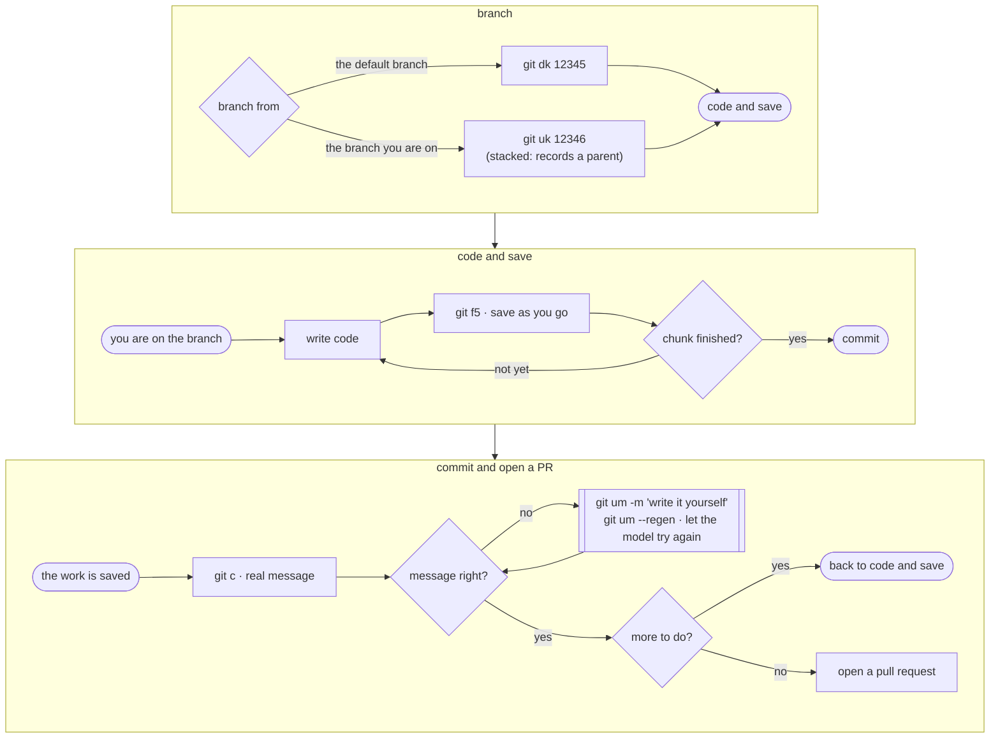

# Working on a ticket

From "I picked up COM-12345" to "the work is committed". Opening the PR is
[the next doc](opening-a-pull-request.md).



## Start the branch

```sh
git dk 12345
```

Syncs the default branch, reads the ticket's title from Linear, shortens it to a
slug, and puts you on `COM-12345.schedule-rebuild-window`. `at.ticket.prefix`
supplies the `COM-`.

Other ways in, when you don't want that:

```sh
git dk 12345 rebuild-window        # your slug, no model call
git dk UAT-12345                   # a key from another team
git dk my-slug                     # no ticket at all
git dk COM-12345.rebuild-window    # the whole name, as-is
```

If `at.status.dk` is set, the ticket moves as you start.

What `dk` records: `branch.<name>.atbase`, the commit your work begins after.
Everything downstream reads it — `fb`, the patch commands, `dr`, the PR body. It
survives the default branch being squash-merged, which a merge base does not.

### Stacking on work that isn't merged yet

When the next piece depends on the branch you're on:

```sh
git uk 12346
```

Same naming, but it branches from where you are and records `atparent` as well.
Uncommitted work comes along as a quicksave; `--no-f5` leaves it uncommitted.

## Save constantly

```sh
git f5
```

Stages everything and commits it as `working`. Run it again and it amends that
same commit. No hooks, no model, no thinking — it's a save key, and the message
is throwaway.

```sh
git s
```

Shows the last commit, the ticket, the parent branch, where your work begins and
how many commits sit on top, then `git status`.

## Commit for real

```sh
git c
```

Commits what's **staged** — `c` doesn't stage for you. It generates the message
from the staged diff and opens it in your editor. On top of a quicksave it amends,
so `working` never survives into history.

```sh
git c --all        # stage everything first (asks), then commit
git c -u           # stage tracked changes only
git c -y           # skip the editor
git c -m 'fix(x): by hand'   # no model call
git c --verify     # run hooks; they're skipped by default
git c --cc         # Co-Authored-By from at.commit.coauthor
git c --cc 'Claude Opus 5 <noreply@anthropic.com>'   # or name it outright
```

### What the message looks like

One change, one conventional subject:

```
fix(rebuild): stop double-firing when a worker restarts mid-job
```

Several distinct changes: a plain summary subject, one conventional line each in
the body:

```
stripe payment methods end to end

feat(stripe): list saved payment methods
feat(portal): show saved methods on the billing page
test(stripe): cover the listing endpoint
```

Scope comes from the scopes already in your `git log`, falling back to the changed
paths. Type is one of `feat fix chore docs refactor test perf build ci`.

`issue: COM-12345` is added from the branch name. `Co-Authored-By` is added only
with `--cc`, because the trailer attributes the *code*, not who wrote the message.
Trailers the model invents are stripped.

Edit `rules/commit.md` if you want different output — that file is the prompt.

## Fix the last commit

```sh
git um             # amend, keep the message
git um -u          # stage tracked changes, then amend
git um --all       # stage everything (asks), then amend
git um --regen     # rewrite the message from the amended diff
```

## See what you've done

```sh
git fb             # diff from your branch point: your work, not your parent's
git fk             # diff from the default branch: everything that would land
git ll             # last commit, with file names
```

On a stacked branch those two differ, which is the point.

## What can bite

**`c` commits the index, not the tree.** Forgetting to stage means committing
nothing, or committing half. `--all` and `-u` are there for that.

**No `at.llm.command` means no generated message.** `c` stops and tells you to use
`-m`. Everything else still works.

**A generated message is a draft.** It sees the diff, not the ticket, not the
conversation you had about it. The editor opens for a reason; `-y` skips it when
you've read the diff yourself.

**Quicksaves are local.** `f5` commits, it doesn't push. Nothing leaves your
machine until you push or open a PR.
