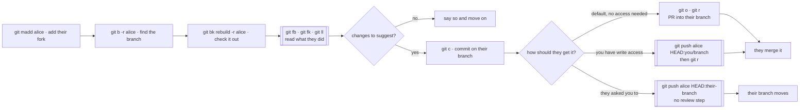

# Working with a collaborator

Someone else has work in their fork: a branch you want to review, take over, or
push a fix into. Their fork becomes a remote in your checkout, named after them.



## Add their fork

```sh
git madd alice
```

Adds a remote called `alice` pointing at `alice/<same repo>`, derived from your
own remote's URL, and fetches it. Their fork of a different repo, or a different
name for the remote:

```sh
git madd alice their-fork-name     # different repo
git madd alice gitconfig ali       # remote named `ali`
```

## Find the branch

```sh
git b -r alice              # their branches (fetches first)
git b rebuild -r alice      # the ones matching `rebuild`
git b -i -r alice           # with author dates, so you can see what's recent
```

## Check it out

```sh
git bk rebuild -r alice
```

Creates a local branch `r/alice/COM-12345.rebuild-window` tracking theirs, and
records where their work began — asking `gh` for the PR's base branch when there
is one, so a stacked branch of theirs is understood as stacked.

The `r/` prefix keeps their branches visually separate from yours in `git b`.

## Review it

```sh
git fb        # what they changed, from their branch point
git fk        # everything that would land, against the default branch
git ll        # the last commit with file names
git lg        # the graph
git s         # the ticket, the parent, how many commits since the branch point
```

`fb` is usually the one you want: on a stacked branch it shows their work without
their parent's.

## Suggest changes

Commit on their branch as you normally would:

```sh
git f5        # save as you go
git c --all   # commit for real
```

Then publish your version somewhere they can review it. **Don't push into their
working branch by default** — an unannounced update to a branch someone is
working on is how you lose their uncommitted rebase.

### Your fork, then a PR against their branch

The default, and the only route that needs no access to their fork:

```sh
git o     # push to your own fork
git r     # the PR goes to alice's repo, against the branch you checked out
```

`r` works that out from the tracking ref `bk -r` set up, and says so:

```
opening a PR against COM-12345.rebuild-window on alice/gitconfig (this branch tracks alice)
```

`--repo` and `--base` override it when that guess is wrong.

GitHub allows a PR between any two repos in the same fork network, so this opens
in *their* repo with your fork as the head. They review and merge it into their
branch, and their own PR carries your change along.

### A branch on their fork

If they've made you a collaborator and prefer the work sitting on their fork,
push under a name that says whose it is:

```sh
git push alice HEAD:you/COM-12345.rebuild-window
git r
```

The explicit refspec matters. Your local branch is called
`r/alice/COM-12345.rebuild-window`, and with `push.default = current` a bare
`git push alice HEAD` pushes under *that* name — which reads as "alice's copy of
alice's branch" on her fork, and tells nobody it's yours.

### Straight into their branch

When they've asked for it — pairing, or "fix the test on my branch" — say so
outright:

```sh
git push alice HEAD:COM-12345.rebuild-window
```

Their branch moves and their PR updates with no review step. If they've rebased
since you fetched, git refuses: fetch and rebase your copy rather than forcing.

## Take it over

When the branch becomes yours — they're out, or it was handed off:

```sh
git dr      # onto current master, skipping anything already landed
git oof     # to your own fork
git r       # your PR
```

Nothing about the branch is tied to their fork except the tracking ref.

## Clean up

```sh
git remote remove alice
git bdf r/alice/COM-12345.rebuild-window
```

`git bd` won't remove their branch until its content lands on the default branch,
which is usually what you want.

## What can bite

**Their branch is theirs.** Rebasing it, then force-pushing to their fork,
rewrites history under someone who may have local work on it. Rebase your own
copy, or ask.

**A bare push to their fork creates a badly-named branch.** See above: name the
branch on their side explicitly. `git b -r alice` shows what you actually pushed,
and `git push alice --delete r/alice/<branch>` cleans up the mistake.

**Check the line `r` prints before it pushes.** It names the repo and branch it
is about to target, including whose remote it inferred that from. If it says
`upstream` and the default branch on a branch of theirs, the tracking ref is
missing — pass `--repo` and `--base`.

**`madd` guesses the URL** from your own remote's, so the repo name and host come
from yours. Pass the repo name when their fork is named differently.

**Ticket transitions follow the branch name.** Committing on their
`COM-12345.*` branch adds `issue: COM-12345` to your commits, and `r` may move
that ticket if `at.status.r` is set. That's usually right, occasionally not.
